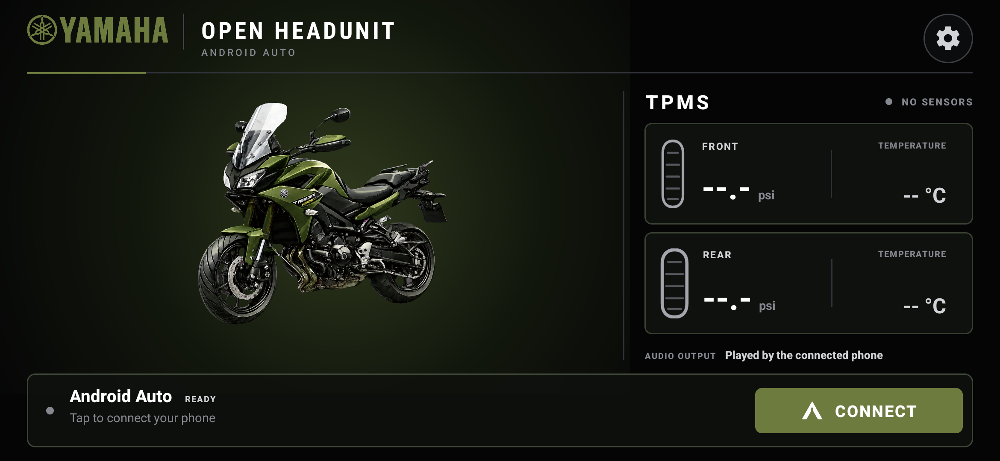
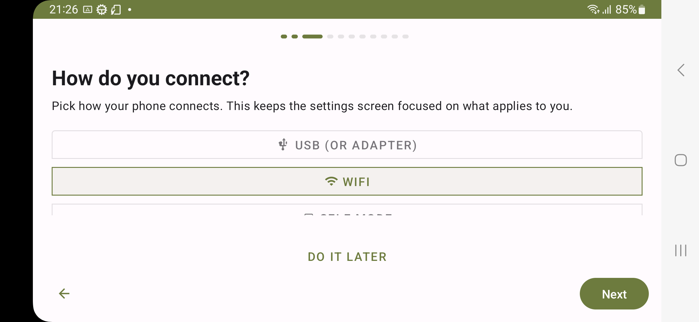
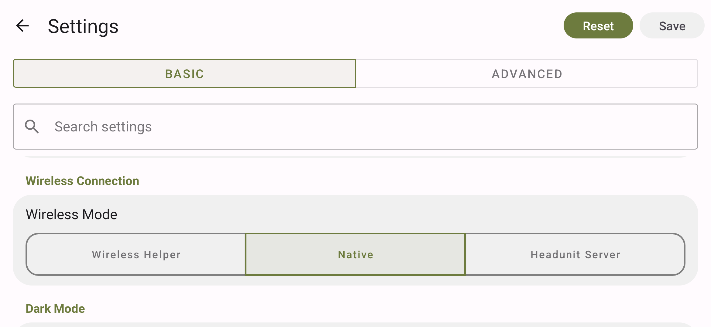
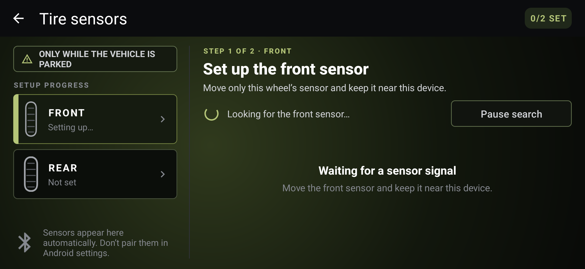

# XCover Android Auto receiver

This experimental project turns a Samsung Galaxy XCover Pro into a dedicated, software-only wireless Android Auto display using a patched Open Headunit application. The validated path does not require root, a USB Android Auto dongle, or a companion application on the projecting phone.

End-to-end projection has been verified only on a Samsung Galaxy XCover Pro `SM-G715U1` running Android 13 / One UI 5.1 with an Android projecting phone whose model is intentionally withheld. Other receiver models, firmware builds, and projecting phones are unverified.

[Download the latest release](../../releases/latest) · [Read the complete user guide](docs/user-guide.md) · [See the verified device state](docs/current-state.md)



*Dedicated receiver home on the physical XCover Pro: one Android Auto action, local front/rear TPMS surfaces, and no phone-mode, USB, or CarPlay clutter. Missing sensor values are intentionally blank.*

> [!IMPORTANT]
> Perform installation, pairing, configuration, and troubleshooting only while the vehicle is parked. The physical LEEPEE/MotorCare TPMS protocol, real intercom audio path, long-term sunlight/thermal behavior, and ignition interruptions still require validation.

## What is included

| Capability | Current status |
|---|---|
| Wireless Android Auto | Verified on the tested receiver/phone pair; phone model withheld |
| Bluetooth trigger and HFP SLC | Verified |
| 5 GHz Wi-Fi Direct projection | Verified |
| Fixed landscape receiver UI | Verified |
| Automatic wake on stable external power | Verified on the configured XCover |
| Unplugged screen timeout and Doze | Verified on the configured XCover |
| Automatic Android Auto retries stop while unplugged | Verified on the configured XCover |
| Rain touch lock on the programmable side key | Verified on the physical XCover |
| BLE TPMS setup, parsing framework, stale-data handling, and alert simulation | Implemented and tested |
| Physical LEEPEE/MotorCare TPMS readings and thresholds | Pending hardware capture and calibration |
| Music, calls, prompts, and microphone through a motorcycle intercom | Pending real-intercom validation |

The APK provides the receiver application and its in-app behavior. Fixed rotation, power policy, silent notifications, lock-screen behavior, wireless-debug restoration, and optional package cleanup are separate device-provisioning steps.

## Install the latest APK

### Requirements

- Samsung Galaxy XCover Pro `SM-G715U1`;
- Android 13 / One UI 5.1 for the verified configuration;
- a computer with [Android platform-tools](https://developer.android.com/tools/releases/platform-tools) and `adb`;
- USB debugging or an already-authorized wireless ADB connection;
- the APK, `SHA256SUMS.txt`, and `APK-METADATA.txt` from the same GitHub Release.

### 1. Download and verify

Download all three assets from the [latest release](../../releases/latest). From the download directory, verify the APK checksum on macOS or Linux:

```sh
shasum -a 256 -c SHA256SUMS.txt
```

On Windows PowerShell, compare the result of this command with the hash beside the APK filename in `SHA256SUMS.txt`:

```powershell
Get-FileHash .\open-headunit-tpms-xcover-<tag>-debug.apk -Algorithm SHA256
```

The macOS/Linux command must report `OK`; on Windows, the two hexadecimal hashes must match exactly. The expected package name and signing-certificate fingerprint are also recorded in `APK-METADATA.txt`.

### 2. Confirm the receiver

Connect ADB, accept the computer fingerprint on the receiver, and identify the exact target before installing anything:

```sh
adb devices -l
adb -s <receiver-serial> shell getprop ro.product.model
```

Continue only when the selected device reports `SM-G715U1`.

### 3. Install or update

```sh
adb -s <receiver-serial> install -r open-headunit-tpms-xcover-<tag>-debug.apk
```

`adb install -r` preserves settings only when the installed app and the update use the same signing certificate. If Android reports `INSTALL_FAILED_UPDATE_INCOMPATIBLE`, stop. Use `adb -s <receiver-serial> shell dumpsys package com.andrerinas.headunitrevived.hfpslc` to identify the installed version, then compare the candidate fingerprint with that release's `APK-METADATA.txt` or the official fingerprint in the [APK ledger](apks/README.md). Uninstalling the existing package removes its settings and TPMS assignments.

The public APK is debug-signed for manual sideloading. It is not distributed through Google Play.

## First-time Android Auto setup

1. Enable Bluetooth and Wi-Fi on both the XCover and the projecting phone.
2. Pair the phone with the XCover in Android Bluetooth settings and confirm the same pairing code on both devices.
3. Open **Open Headunit TPMS**. On a fresh install, complete the welcome wizard:
   - accept the parked-use safety notice;
   - select **WiFi** only for the connection type;
   - keep the detected display size, choose landscape, and use the recommended DPI;
   - keep the automation defaults until the first projection works;
   - select **Connected phone** as the location source for the validated path;
   - grant **Nearby devices** and **Notifications**. Grant **Display over other apps** for automatic startup; without it, open the app manually after applying power. Grant **Microphone** for voice/calls and **Location** only when using receiver GPS or location-based night mode.
4. Finish the wizard. Open the gear button and confirm **Connection mode: WiFi** and **Wireless Mode: Native**, then select **Save**.
5. If no phone has been selected, press and hold **Connect**, then choose the paired phone.
6. Select **Connect** and accept any Android Auto confirmation on the projecting phone while parked.



*For the validated wireless path, leave USB and Self Mode disabled.*



*The validated software-only path uses WiFi connection mode with Native wireless discovery.*

### Samsung static-BSSID step

On the validated Samsung firmware, the first connection also required the active Wi-Fi Direct group-interface address in **Static BSSID**. The first connection attempt creates the group even when projection does not finish.

Inspect the active group interface without recording its address in the repository:

```sh
adb -s <receiver-serial> shell ip addr show dev p2p-wlan0-0
```

Copy only the `link/ether` value into **Settings → Static BSSID**, then select **Save**. Restart the app with **App info → Force stop → Open**, or use:

```sh
adb -s <receiver-serial> shell am force-stop com.andrerinas.headunitrevived.hfpslc
adb -s <receiver-serial> shell am start -n com.andrerinas.headunitrevived.hfpslc/com.andrerinas.openheadunit.main.MainActivity
```

Try **Connect** again. Do not publish or commit the BSSID, Wi-Fi Direct SSID, password, Bluetooth address, or pairing code.

If `p2p-wlan0-0` does not exist, start a Native connection once and list the interfaces carrying an IPv4 address:

```sh
adb -s <receiver-serial> shell ip -o addr show
adb -s <receiver-serial> shell ip addr show dev <group-interface>
```

Identify the active Wi-Fi Direct group-owner interface created by the current Native connection attempt and use only its `link/ether` value. Do not copy an address from an arbitrary `p2p-` interface. If the group interface is ambiguous, stop and follow the [root-cause analysis](docs/android-auto-xcover-only.md#root-cause-incorrect-wi-fi-direct-bssid).

The full first-connection walkthrough and safe checkpoints are in [the user guide](docs/user-guide.md#first-time-android-auto-setup).

## Daily operation

After setup on the configured receiver:

1. keep Bluetooth and Wi-Fi enabled on both devices;
2. apply external power to the XCover;
3. wait for the display to wake and **Open Headunit TPMS** to open;
4. allow approximately ten seconds for Android Auto to reconnect;
5. if projection does not start, select **Connect** once.

No companion app needs to be opened on the projecting phone. During projection, that phone may leave its normal Wi-Fi network to join the XCover Wi-Fi Direct group. Wireless ADB to the phone may therefore disappear until projection ends.

When external power is removed, automatic Android Auto wake retries stop so the parked receiver does not repeatedly wake its wireless subsystem. **Connect** remains available for an explicit manual attempt. Stable external power restarts the automatic retry cycle.

The XCover programmable side key (`keyCode 1015`) toggles a rain touch lock. One press blocks application touch while projection, display, and audio continue; a second press restores touch. Restarting the app always returns to unlocked input.

The receiver is Android's default launcher. **Apps** opens its own two-column app drawer; **System settings** is the first drawer item, followed left-to-right and then downward by any enabled launchable apps. Each card centers its icon and label. The drawer header contains only a Back action, and Android Back also returns to the receiver home. Disabled cleanup packages are not shown. One UI Home remains installed and enabled only as the rollback launcher.

## TPMS

TPMS sensors are discovered from Bluetooth Low Energy advertisements. Do **not** pair them in Android Bluetooth settings.

1. Open **Tire sensors** from the receiver home.
2. Grant **Nearby devices** if Android requests it.
3. Move only the highlighted front sensor and select **Use sensor** when the intended candidate appears.
4. Repeat for the rear sensor and select **Finish**.



*The receiver assigns BLE sensors locally to Front and Rear. This English screenshot shows the scanning state, not a successful physical-sensor reading.*

Assignments survive reboot and APK updates signed with the same certificate. Readings expire after ten minutes without a fresh advertisement, so stale telemetry returns to `--.-` and `-- °C`.

The decoder framework, setup flow, test fixture, alert evaluation, localization, and simulation are implemented. The purchased LEEPEE/MotorCare packets have not yet been captured or compared with a known gauge. Until that work is complete, physical compatibility and alert thresholds remain provisional. See [the TPMS integration guide](docs/tpms-integration.md).

## Optional dedicated-device provisioning

Installing the APK does not apply every Android setting used on the validated receiver. The projection path works independently of the cleanup batches.

Clone this repository and run every script from its root:

```sh
git clone <repository-url>
cd xcover-android-auto-receiver
scripts/inventory.sh <receiver-serial>
```

The inventory excludes personal application content and redacts the ADB target, but it still contains device-specific diagnostics. Raw snapshots are local-only and ignored by Git. Publish only a minimal English summary with unique device details removed.

| Purpose | Apply | Roll back |
|---|---|---|
| Fixed landscape | `scripts/configure-landscape.sh` | `scripts/rollback-landscape.sh` |
| Battery Protect and initial brightness baseline | `scripts/configure-power-baseline.sh` | `scripts/rollback-power-baseline.sh` |
| Powered stay-awake, maximum manual brightness, unplugged timeout, and Doze | `scripts/configure-unplugged-sleep.sh` | `scripts/rollback-unplugged-sleep.sh` |
| Silent notification stream | `scripts/configure-silent-notifications.sh` | `scripts/rollback-silent-notifications.sh` |
| No-credential boot and wireless-debug restoration | `scripts/configure-dedicated-boot.sh` | `scripts/rollback-dedicated-boot.sh` |
| Receiver as default launcher, with One UI Home retained for rollback | `scripts/configure-dedicated-launcher.sh` | `scripts/rollback-dedicated-launcher.sh` |
| Full ART compilation and 0.5× system animations | `scripts/configure-receiver-performance.sh` | `scripts/rollback-receiver-performance.sh` |
| Optional application cleanup | `scripts/cleanup-batch-*.sh` | matching `scripts/rollback-cleanup-batch-*.sh` |

Review every script before running it. Apply one category at a time, reboot, and verify Settings, launcher, Wi-Fi, Bluetooth, charging, Android Auto, and rollback before continuing. The boot script is only appropriate for a dedicated receiver with no secure lock credential.

See [Optional dedicated-device provisioning](docs/user-guide.md#optional-dedicated-device-provisioning) for the safe order and acceptance checks.

## Troubleshooting

| Symptom | Check first |
|---|---|
| No phone appears | Pair it in Android Bluetooth settings, grant Nearby devices, then press and hold **Connect** |
| The phone is found but projection never opens | Confirm **WiFi** + **Native**, then compare **Static BSSID** with the active `p2p-` interface |
| Projection worked before a reboot | Recheck the active group-interface BSSID; Samsung may recreate the interface |
| APK update fails with `INSTALL_FAILED_UPDATE_INCOMPATIBLE` | Stop and compare signing fingerprints; do not uninstall unless settings loss is acceptable |
| The receiver remains locked after reboot | Automatic dismissal supports only a lock screen with no PIN, password, pattern, or biometric requirement |
| Wireless ADB disappeared after reboot | Re-enable Wireless debugging, discover the current TLS port with `adb mdns services`, and reconnect |
| A TPMS candidate assigns but never shows readings | Physical protocol support is still provisional; collect the sanitized diagnostic line described in the TPMS guide |

For detailed recovery commands, see [the complete user guide](docs/user-guide.md#troubleshooting).

## How the connection works

```text
Projecting phone
  └─ Bluetooth HFP SLC and Android Auto credential exchange
       └─ 5 GHz Wi-Fi Direct projection
            └─ XCover receiver / Open Headunit TPMS
                 ├─ Android Auto video and input
                 └─ receiver-owned BLE TPMS UI and alert overlay
```

Two Open Headunit changes made Native projection work on the tested pair:

1. complete the HFP Service Level Connection instead of only holding an HFP socket open;
2. use the Wi-Fi group-interface BSSID rather than the P2P device address.

The investigation and evidence are in [the Android Auto technical analysis](docs/android-auto-xcover-only.md).

## Build an official release candidate

The repeatable build script creates a clean upstream clone, checks out Open Headunit commit `581a55f26fe74b2c93eae5778ddcd683eb08b113`, applies both patches in order, runs unit tests, builds the APK, and validates its identity and certificate:

```sh
ANDROID_HOME=/path/to/Android/sdk \
  scripts/build-release-apk.sh v0.3.0
```

The verified toolchain uses JDK 17, Android SDK 36, and NDK `29.0.14206865`. The release script expects the established maintainer certificate. Independent developers may build with their own key for local testing, but that APK cannot update or replace the official public build.

For exact build, physical-validation, signing, tagging, publication, and post-download checks, read [the release process](docs/release-process.md).

## Verification and open risks

Verified on 2026-08-05:

- HFP SLC, Android Auto Bluetooth messages 1/2/3, 5 GHz Wi-Fi Direct, and projection;
- reconnect after app restart and cold boot;
- fixed landscape home, power wake, unplugged timeout, and Doze entry;
- cancellation of automatic Android Auto wake retries after a reversible simulated power removal on the physical receiver, their restart on powered operation, and the ten-second startup wake-lock bound;
- TPMS parsing, assignment, expiration, simulation, localization contract, and projection overlay without physical sensors;
- side-key rain lock mapping and immediate touch interception on the physical XCover.

Still pending:

- real intercom music, navigation prompts, calls, and microphone;
- prolonged GPS, charging, direct-sunlight, and thermal validation;
- ignition micro-interruption testing on the vehicle;
- physical LEEPEE/MotorCare BLE packet validation and threshold calibration;
- one live Android Auto projection check of the rain lock.
- a repeated overnight unplugged discharge measurement with `v0.2.0`.

The complete, dated matrix is maintained in [docs/current-state.md](docs/current-state.md).

## Documentation

- [Complete installation and operation guide](docs/user-guide.md)
- [Canonical installed state and open risks](docs/current-state.md)
- [Native Android Auto investigation](docs/android-auto-xcover-only.md)
- [TPMS architecture and validation](docs/tpms-integration.md)
- [Dedicated home UI and visual evidence](docs/dedicated-home-ui.md)
- [English-first copy and localization rules](docs/copy-guidelines.md)
- [Public APK release process](docs/release-process.md)
- [APK provenance and integrity ledger](apks/README.md)

## License, upstream attribution, and theme

Open Headunit-derived patches are distributed under the [GNU Affero General Public License v3.0](LICENSE). Preserve the upstream Open Headunit and Mike Reid copyright, license, and attribution notices.

The current screenshots include a personal, non-commercial Yamaha/Tracer theme. Yamaha and Tracer names, marks, and visual assets belong to their respective owners. This project is unofficial and is not sponsored, endorsed, or affiliated with Yamaha. The receiver package and operational copy remain generic.
