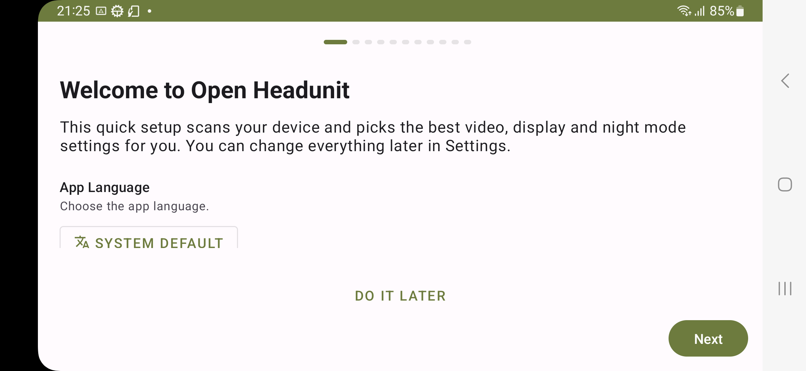
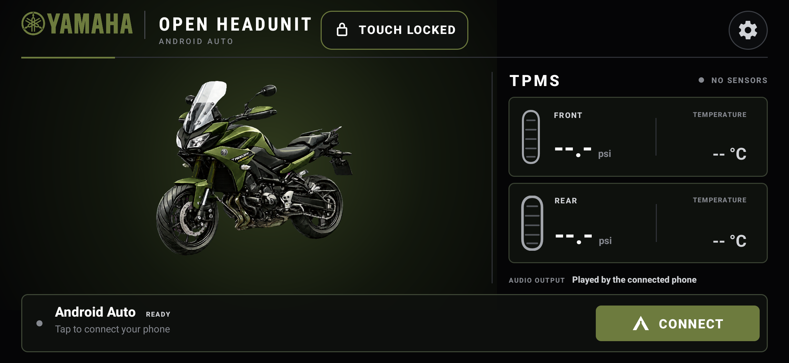
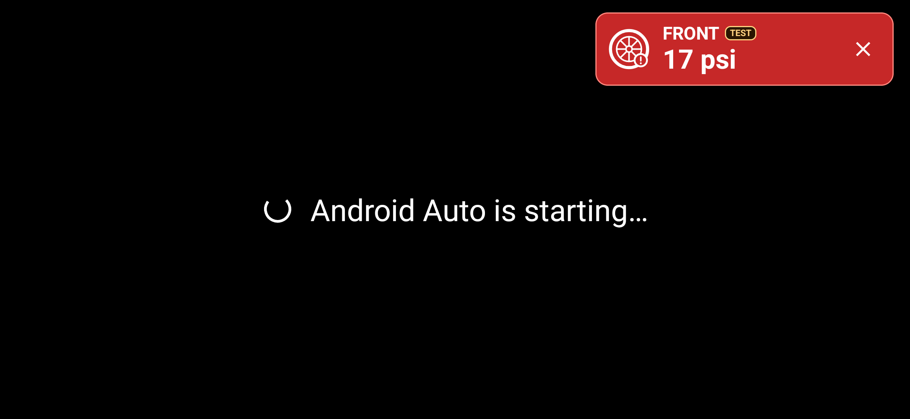

# Installation and operation guide

This guide covers the complete path from a public APK release to a working dedicated receiver. It separates the minimum Android Auto setup from optional Android device provisioning and package cleanup.

## Safety and compatibility boundary

- Perform every setup, pairing, permission, and troubleshooting step while the vehicle is parked.
- The verified receiver is Samsung Galaxy XCover Pro `SM-G715U1`, Android 13, One UI 5.1.
- The verified projecting phone is an Android phone whose model is intentionally withheld.
- Other XCover variants, Android builds, and projecting phones may work, but are not yet verified.
- Root, a USB Android Auto dongle, and a companion app on the projecting phone are not required for the verified path.
- Physical LEEPEE/MotorCare TPMS compatibility and thresholds remain provisional.
- Intercom music, prompts, calls, and microphone behavior still require testing with the actual riding equipment.

Do not begin package cleanup or automatic lock-screen changes until the base APK has completed one full Android Auto session.

## Before you begin

You need:

- the XCover receiver and its projecting phone;
- a computer with Android platform-tools and `adb`;
- a USB data cable for the simplest first authorization, or an already-authorized Wireless debugging connection;
- Bluetooth and Wi-Fi enabled on both Android devices;
- the APK, `SHA256SUMS.txt`, and `APK-METADATA.txt` from one GitHub Release;
- a safe workbench power source.

The APK install is the minimum required change. Rotation, power, notification, boot, ADB, and cleanup scripts are optional and independent.

## Install the APK

### 1. Download one complete release

Open the [latest GitHub Release](../../../releases/latest) and download:

- `open-headunit-tpms-xcover-<tag>-debug.apk`;
- `SHA256SUMS.txt`;
- `APK-METADATA.txt`.

Keep all three files in the same directory.

### 2. Verify the APK

On macOS or Linux:

```sh
shasum -a 256 -c SHA256SUMS.txt
```

On Windows PowerShell, compare this result with the hash beside the APK filename in `SHA256SUMS.txt`:

```powershell
Get-FileHash .\open-headunit-tpms-xcover-<tag>-debug.apk -Algorithm SHA256
```

Continue only when the macOS/Linux check reports `OK`, or when both Windows hashes match exactly. Open `APK-METADATA.txt` and confirm that it identifies package `com.andrerinas.headunitrevived.hfpslc`.

### 3. Authorize and identify the receiver

Enable Developer options and USB debugging on the XCover. Connect it to the computer and accept the displayed computer fingerprint.

```sh
adb devices -l
adb -s <receiver-serial> shell getprop ro.product.model
```

Continue only when the selected target is the intended receiver and reports `SM-G715U1`.

### 4. Install or update

```sh
adb -s <receiver-serial> install -r open-headunit-tpms-xcover-<tag>-debug.apk
```

Expected result:

```text
Success
```

For a fresh install, `-r` is harmless. For an update, it preserves app data only when both APKs use the same certificate.

If Android reports `INSTALL_FAILED_UPDATE_INCOMPATIBLE`, stop. Identify the installed version:

```sh
adb -s <receiver-serial> shell dumpsys package com.andrerinas.headunitrevived.hfpslc
```

Find `versionName`, then compare the candidate fingerprint with that release's `APK-METADATA.txt` or the official fingerprint in the [APK ledger](../apks/README.md). If the installed build's source is unknown, do not guess. Uninstalling it is a destructive choice because it removes settings and TPMS assignments.

## First-time Android Auto setup

### 1. Pair the phone and receiver

1. Enable Bluetooth and Wi-Fi on both devices.
2. Open Android Bluetooth settings on either device.
3. Select the other device and confirm the same pairing code on both screens.
4. Leave the Bluetooth bond in place. The app uses it to initiate the native Android Auto handshake.

This Bluetooth bond is separate from TPMS discovery. Tire sensors must not be bonded in Android settings.

### 2. Complete the first-run wizard

Open **Open Headunit TPMS**. A fresh install starts with an 11-step wizard:

1. **Welcome:** select the language you want the app to follow.
2. **Safety:** read and accept the parked-use notice.
3. **Connection:** select **WiFi** only. Leave USB and Self Mode disabled for this receiver.
4. **Display:** keep the detected dimensions and select landscape.
5. **DPI:** keep the recommended value for the first test.
6. **Appearance:** choose your preferred theme; it does not change the transport.
7. **Automation:** keep the defaults until the base projection path works.
8. **GPS:** select **Connected phone** for the validated phone-projection path.
9. **Vehicle:** use a generic receiver name that does not expose personal information.
10. **Permissions:** grant **Nearby devices** and **Notifications**. Grant **Display over other apps** when using automatic startup; if denied, open the app manually after applying power. Grant **Microphone** for voice/calls and **Location** only when using receiver GPS or location-based night mode. The validated **WiFi + Native** path does not require **Modify system settings**; grant it only if you deliberately enable the separate **Auto-enable hotspot** option.
11. **Ready:** review the summary and select **Finish**.




*The validated receiver uses WiFi only. USB and Self Mode are intentionally disabled.*

If the wizard does not appear because the app was already configured, continue with the settings check below.

### 3. Confirm Native receiver settings

1. Select the gear button.
2. Under **Basic**, confirm **Connection mode: WiFi**.
3. Set **Wireless Mode** to **Native**.
4. Select **Save**.


*Native is the validated discovery mode. The receiver transports projection over Wi-Fi Direct after the Bluetooth handshake.*

### 4. Select the projecting phone

Return to the receiver home:

- select **Connect** when the intended phone was already saved;
- press and hold **Connect** to open the paired-device selector when the phone is missing or the wrong phone was saved.

Choose the paired projecting phone. The home should show **Connecting** while it prepares the wireless connection.

Watch the projecting phone and accept its Android Auto confirmation when prompted. The receiver cannot approve this prompt on the phone's behalf.

### 5. Complete the Samsung static-BSSID step

On the validated Samsung firmware, automatic discovery returned the Wi-Fi Direct device address rather than the active group-interface BSSID. The correct value must be saved once and rechecked if Samsung recreates the group.

1. Start a Native connection once so the XCover creates its Wi-Fi Direct group.
2. Inspect the expected group interface:

   ```sh
   adb -s <receiver-serial> shell ip addr show dev p2p-wlan0-0
   ```

3. Find the `link/ether` line.
4. In receiver settings, search for **Static BSSID**.
5. Enter only that `link/ether` value and select **Save**.
6. Restart **Open Headunit TPMS** using **App info → Force stop → Open**, or run:

   ```sh
   adb -s <receiver-serial> shell am force-stop com.andrerinas.headunitrevived.hfpslc
   adb -s <receiver-serial> shell am start -n com.andrerinas.headunitrevived.hfpslc/com.andrerinas.openheadunit.main.MainActivity
   ```

7. Select **Connect** again.

If `p2p-wlan0-0` is absent, start a Native connection once and list the interfaces carrying an IPv4 address:

```sh
adb -s <receiver-serial> shell ip -o addr show
adb -s <receiver-serial> shell ip addr show dev <group-interface>
```

Identify the active Wi-Fi Direct group-owner interface created by the current Native connection attempt and use only its `link/ether` value. Do not copy an address from an arbitrary `p2p-` interface. If the group interface is ambiguous, stop and follow the [root-cause analysis](android-auto-xcover-only.md#root-cause-incorrect-wi-fi-direct-bssid).

Never commit or publish the BSSID, Wi-Fi Direct SSID, password, Bluetooth address, or pairing code.

### 6. Prove the minimum path

Before changing the rest of Android, verify:

1. Android Auto opens on the XCover.
2. The app can be closed and re-opened without losing the saved phone.
3. Projection reconnects after one app restart.
4. Bluetooth and Wi-Fi remain functional after one XCover reboot.
5. The static BSSID still matches the active group interface after that reboot.
6. For automatic daily use, remove and reapply external power while the XCover has no secure lock credential. Confirm that the screen wakes and the receiver opens. If it does not, grant **Display over other apps** and confirm **Settings → Automatic startup → Start when power is connected** is enabled.

Only continue to dedicated-device provisioning after these checks pass.

## Daily operation

On the configured receiver:

1. keep Wi-Fi and Bluetooth enabled on the XCover and projecting phone;
2. apply external power to the XCover;
3. wait for the screen to wake and the receiver app to open;
4. allow approximately ten seconds for reconnection;
5. if projection does not start, select **Connect** once.

No app needs to be opened on the projecting phone. Android Auto may move that phone away from its normal Wi-Fi network while it joins the XCover Wi-Fi Direct group.

When external power is removed, the configured XCover does not shut down immediately. Its display times out after 30 seconds, then Android may enter Light Doze and Deep Doze. Automatic Bluetooth wake retries stop while unplugged so the parked receiver does not repeatedly wake the wireless subsystem. The **Connect** action remains available for an explicit manual attempt. Applying stable external power wakes the display, reopens the receiver app, and restarts automatic Android Auto retries.

### Rain touch lock

The XCover programmable side key reports `keyCode 1015` to this app:

- first press: block app touch and show **Touch locked**;
- second press: restore touch and briefly show **Touch enabled**;
- app process restart: always return to unlocked touch.

Projection, audio, and the display continue while touch is blocked. Android system gestures outside the app remain controlled by Android.



*The physical side key toggles a process-local rain lock. This English capture contains no network or personal identifiers.*

## TPMS setup

TPMS “pairing” in this project is a local assignment of a BLE sensor identifier to **Front** or **Rear**. It is not Android Bluetooth bonding and does not create an exclusive connection.

1. Park the vehicle.
2. Open **Tire sensors** from the receiver home.
3. Grant **Nearby devices** if requested.
4. Move only the highlighted front sensor and keep it near the XCover.
5. Select **Use sensor** when the intended candidate appears.
6. Repeat for the rear sensor.
7. Select **Finish** after both assignments are confirmed.


The setup screen uses higher-intensity scanning. Normal home and projection monitoring uses low-power scanning. Assigned values become stale after ten minutes without a fresh advertisement and return to placeholders.

### Current TPMS limitation

The setup flow, scanner, public protocol fixture, stale-data handling, alert logic, localization, and simulation are tested. The purchased LEEPEE/MotorCare packets have not yet been captured or calibrated against a known gauge.

An unknown candidate can be assigned for diagnosis, but the home deliberately remains in **Waiting** and never fabricates pressure or temperature. See [BLE TPMS integration](tpms-integration.md) for the diagnostic capture procedure.

### Preview the alert safely

The test alert is silent, dismissible, lasts 12 seconds, and does not alter sensor assignments, readings, or thresholds. With the projection surface open, choose **Settings → TPMS → Preview TPMS alert**.



*This visibly marked `TEST` card demonstrates the compact overlay layout on the Android Auto startup surface. It is not a physical-sensor reading.*

## Optional dedicated-device provisioning

These changes are not required to prove Android Auto. Apply them separately, with the matching rollback script ready.

Clone this repository and work from its root before running the scripts:

```sh
git clone <repository-url>
cd xcover-android-auto-receiver
scripts/inventory.sh <receiver-serial>
```

The inventory excludes accounts, contacts, messages, saved networks, Bluetooth peers, and application data, and it redacts the ADB target. It still contains device-specific diagnostics. Raw snapshots are local-only and ignored by Git; publish only a minimal English summary with unique device details removed.

### Safe order

1. Capture an inventory.
2. Configure fixed landscape.
3. Configure powered brightness and unplugged sleep.
4. Configure silent notifications if wanted.
5. Decide whether the device will have no secure lock credential before applying dedicated boot behavior.
6. Apply optional cleanup batches one at a time.
7. Install and exercise a receiver APK that exposes the dedicated `HOME` role.
8. Apply receiver performance settings, then select the receiver as the default launcher.
9. Confirm **Apps** opens the receiver's native drawer and its first item opens **System settings**.
10. Reboot and validate after every category.

### Commands

```sh
scripts/configure-landscape.sh <receiver-serial>
scripts/configure-power-baseline.sh <receiver-serial>
scripts/configure-unplugged-sleep.sh <receiver-serial>
scripts/configure-silent-notifications.sh <receiver-serial>
scripts/configure-receiver-performance.sh <receiver-serial>
scripts/configure-dedicated-launcher.sh <receiver-serial>
```

The performance script compiles the installed receiver DEX with ART's `speed` filter and sets all three system animation scales to `0.5`. APK replacement invalidates the compiled output, so rerun the script after each receiver update. Its rollback requests Android's normal profile-guided filter and restores 1× animation timing; on this receiver, an app without a collected profile may report `verify` afterward.

The launcher script keeps One UI Home installed and enabled for rollback, but daily use remains inside the receiver. **Apps** opens the receiver's own two-column drawer directly, without a parked-use confirmation. **System settings** is pinned as its first item and also opens directly, followed left-to-right and then downward by enabled apps in alphabetical order. Each card centers its icon and label. The drawer header contains only a Back action; it and Android Back return to receiver home, while Android Back from System settings returns to the drawer. Aggressive cleanup may leave only the settings item visible. Pressing Home returns to the receiver. Restore One UI Home as the default at any time with:

```sh
scripts/rollback-dedicated-launcher.sh <receiver-serial>
```

`configure-dedicated-boot.sh` disables only an unsecured lock screen, grants the receiver `WRITE_SECURE_SETTINGS`, and requests Wireless debugging restoration. Review it before use:

```sh
scripts/configure-dedicated-boot.sh <receiver-serial>
```

It cannot and must not bypass a PIN, password, pattern, or biometric requirement.

### Cleanup levels

- `cleanup-batch-01.sh`: clearly optional third-party and promotional packages;
- `cleanup-batch-02-receiver-only.sh`: duplicate apps and earlier receiver paths;
- `cleanup-batch-03-samsung-optional.sh`: optional Samsung surfaces;
- `cleanup-batch-04-hud-only.sh`: aggressive local-app reduction for a receiver-only device.

The projection path does not require these cleanup batches. Batch 02 disables Google Play Store, local Maps, YouTube Music, Google Search, and the local Android Auto phone app. Batch 04 disables phone, contacts, messages, camera, gallery, clock, and other local surfaces. Review the package lists before applying them.

Every cleanup script uses reversible `pm disable-user --user 0` operations and has a matching rollback script.

### Acceptance test after every category

Verify:

- boot and unsecured unlock behavior;
- receiver Home behavior, native **Apps** drawer, **System settings**, and One UI Home rollback;
- Wi-Fi, Bluetooth, and location;
- charging and powered brightness;
- Android Auto connection and reconnection;
- ART compiler status `speed` and animation scales `0.5` after performance provisioning;
- unplugged 30-second screen timeout;
- the matching rollback command.

## Troubleshooting

### No paired phone appears

1. Confirm the phone is bonded in Android Bluetooth settings.
2. Grant **Nearby devices** to the receiver app.
3. Return home and press and hold **Connect**.
4. Select the intended paired phone.

### The phone connects and immediately disconnects

1. Confirm **Connection mode: WiFi**.
2. Confirm **Wireless Mode: Native**.
3. Start a connection once.
4. Compare **Static BSSID** with the active `p2p-` group interface.
5. Save, force-stop and reopen the app as described in the setup section, then retry.

Do not erase the Bluetooth bond as the first response; a stale BSSID can fail after Bluetooth succeeds.

### Projection worked before reboot but not now

Samsung may recreate the Wi-Fi Direct group or interface. Repeat the BSSID comparison before clearing app data or re-pairing Bluetooth.

### APK update is rejected

For `INSTALL_FAILED_UPDATE_INCOMPATIBLE`, run the `dumpsys package` command in the installation section, find `versionName`, and compare the candidate fingerprint with that release's `APK-METADATA.txt` or the [APK ledger](../apks/README.md). A differently signed APK cannot update the public build. Uninstall only if losing app settings and TPMS assignments is acceptable.

### The receiver remains on the lock screen

Automatic dismissal works only with no secure credential. Remove the credential manually if this is an intentionally dedicated device, then apply and verify the dedicated-boot script. Never attempt to bypass a secure credential.

### Wireless ADB disappeared

Wireless debugging normally disables after a restart on this Samsung build. Re-enable it in Developer options, then discover the current TLS port:

```sh
adb mdns services
adb connect <receiver-ip>:<current-adb-port>
```

Pair only when Android presents a new pairing request. Never store the pairing code.

### TPMS assigns but shows no values

The sensor may use an unsupported packet. Do not treat an assignment as proof of decoded telemetry. Follow the sanitized diagnostic procedure in [tpms-integration.md](tpms-integration.md#protocol-boundary).

## Rollback

Remove only the isolated receiver package:

```sh
adb -s <receiver-serial> uninstall com.andrerinas.headunitrevived.hfpslc
```

This removes its settings and TPMS assignments but does not remove the separately packaged upstream receiver.

For Android configuration and cleanup changes, run the matching `scripts/rollback-*.sh` script and re-run the acceptance checks.

## Maintainer path

Installers do not need the Android SDK, NDK, upstream source, or GitHub CLI. Maintainers reproducing and publishing the APK should follow [the public release process](release-process.md), which requires a clean patch build, exact-artifact physical validation, source publication, and post-download checksum verification.
